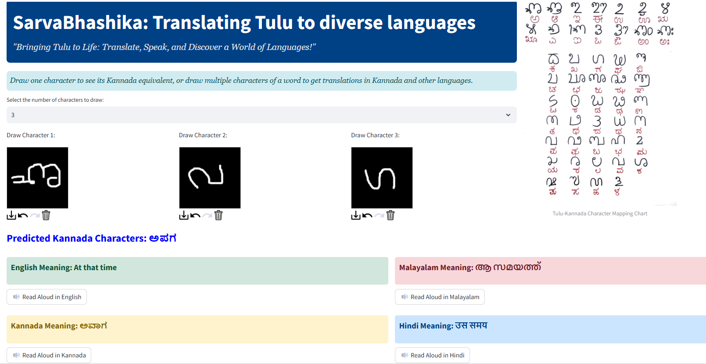

# Sarvabhashika: Translating Tulu to Diverse Languages

**Sarvabhashika** is a deep learning-based project that recognizes Tulu handwritten characters and enables seamless translation of Tulu words into multiple languages, including Kannada, English, Hindi, and Malayalam. This project builds on the foundational workflow of **AksharaSetu**, enhancing its capabilities to translate entire words through character mapping and real-time user interaction. By leveraging a Convolutional Neural Network (CNN) and a Streamlit-powered interface, Sarvabhashika facilitates cultural preservation and linguistic inclusivity.

__Project Workflow__

_The initial stages of Sarvabhashika closely follow the workflow established in AksharaSetu. These include:_

**1. Preprocessing and Character Segmentation**

Scanned A4 sheets containing handwritten Tulu characters are processed. Each sheet is binarized, segmented into individual characters, and stored in folders corresponding to each character.

**2. Data Augmentation**

Augmentation techniques, such as slanting, are applied to simulate diverse handwriting styles, expanding the dataset and improving model robustness.

**3. Tulu to Kannada Mapping**

Each segmented Tulu character is mapped to its corresponding Kannada character, creating a foundational bridge for translation.

**4. Model Training**

A CNN model is trained on the segmented and augmented dataset to classify 49 distinct Tulu characters. The model architecture incorporates convolutional layers for feature extraction, MaxPooling for dimensionality reduction, and fully connected layers for classification.

__Unique Workflow in Sarvabhashika__

**5. Interactive Word Translation**

Instead of recognizing standalone characters, users can draw or select multiple characters to form Tulu words. These words are processed and translated into Kannada, serving as the intermediate language.

**6. Multi-Language Translation**

Translated Kannada words are further mapped to multiple languages, including English, Hindi, and Malayalam, using pre-written mappings in an Excel sheet.

**7. Real-Time User Interface**

A dynamic Streamlit interface enables:
  Drawing Tulu characters on an interactive canvas.
  Real-time word recognition and translation into multiple languages.
  Text-to-speech functionality for each translated language, ensuring accessibility and ease of use.
  

  
  

